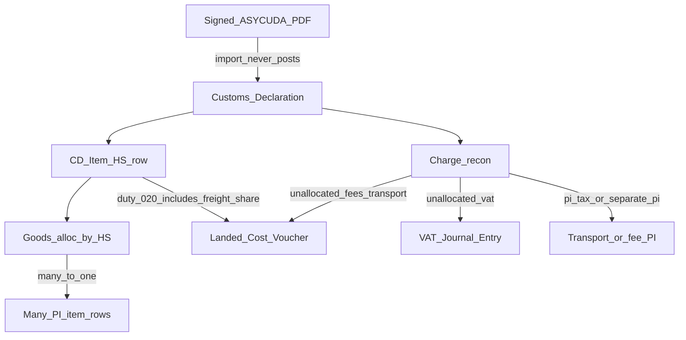

# Moldova Customs V1 — product plan

Source of truth for V1 scope, domain rules, and build slices. Agent working rules (when added) live in [AGENTS.md](../AGENTS.md). Scanned-paper / AI import is [v2-plan.md](v2-plan.md) — same DocTypes, later.

## Goal

One Desk document answers: what Customs declared, what the import cost, which ERPNext documents prove each amount, and which book each amount hits (stock vs VAT vs already on a PI).

- **V1 (now):** official digitally signed ASYCUDA / SAD PDF
- **V2 (later):** same DocTypes; AI on paper scans only
- The app is an empty scaffold today (`0.0.1`)

## Terms

- **SAD** — Single Administrative Document. The standard multi-box customs declaration form (EU / UN layout). In Romanian this is the **DAU** (Documentul Administrativ Unic). Moldova’s signed “declarație vamală” PDF is this form (or an ASYCUDA print of it). Boxes we care about: identity/MRN, goods lines (HS, value), Box 47 taxes.
- **ASYCUDA** — the Customs IT system that issues that signed PDF.
- **MRN** — Movement / declaration reference number printed on the SAD.
- **HS** — Harmonized System commodity code (tariff). Grouping key for CD item ↔ many PI items.
- **CD** — Customs Declaration, our ERPNext hub DocType.
- **020 / 030** — ASYCUDA Box 47 tax types in the sample PDFs: **020** = customs duty (taxă vamală), **030** = VAT 20%. Store the printed type code; do not assume these are the only codes.

## What the examples show

Local folder [examples/](../examples/) (gitignored — real commercial SADs, do not commit). 14 UNCTAD/ASYCUDAWorld PDFs, type **H1**, regime **IM A**, procedure **4000 000**, two **MoldSign** signatures (declarant then officer). Consignee in all samples: HOTEL LIFE S.R.L. (IDNO 1024600026571).

**Identity (use this as `identity_key`, not a guessed MRN-only key):**

- Reference line: `{office} - {declarant} - {year} - {decl_nbr}` e.g. `MD208000 - BRK21869 - 2026 - BRK2186900262`
- Registration `R {nbr} {date}`, assessment `V {nbr} {date}`
- Also printed: `26MD208000R7021462`-style reference

**Items and duty:**

- Many items per SAD (SPLAST: 6 HS lines; GFL: 4; LIGHTSOURCE: 3 mixed rates)
- Duty is **per item** in Box 47: type **020** + rate + tax base + amount. No 020 line = **0% duty** (ISM Turkey, SPLAST Poland, GFL Italy)
- Rates in these files: **0, 8, 10, 12, 15** (LIGO 8%, FANGJIU/LIGHTSOURCE 10%, HONG YA 12%, JINGSHANGPIN footwear **15%**). Do not hardcode 5/8/10/12
- VAT type **030** at 20%. When duty exists, VAT base = statistical value + duty (FANGJIU: 54335.14 + 5433.51 = 59768.65)
- **One HS line lists several commercial SKUs** in Box 31 (LIGO: four hair-dryer models under `85163100`; FANGJIU: two shelf sizes under `94032080`; GFL item 1: several conditioner SKUs). Goods alloc is many PI rows → one CD item

**Value / transport / duty-on-freight:**

- Box 22: invoice currency + amount + exchange rate
- Box 43 V.M.: `a+b+c+d-e` additions/deductions (freight/insurance often land here)
- Box 46: statistical value = **duty tax base already including that row’s share of transport**
- No separate Box 47 freight tax. Customs **distributes transport across item rows (usually by amount)**, then applies the row’s 020 rate to the inclusive base
- So each row’s **020 amount already includes duty on its freight share**. Example (LIGO): invoice ≈ 63,736 MDL, statistical 70,808.89, 8% duty 5,664.71 — that 5,664 includes ~566 duty on the ~7,073 freight slice. Do not compute a second “duty on transport”
- Recon: map PI goods to Box 22 / item prices; map PI freight (tax row or separate PI) to the invoice-vs-statistical gap; treat 020 as one landed-duty figure per row

**Parser:** PDFium text layer is present (extractable). Layout is a form template mixed with values — parse by box labels and Box 47 `Amount / Rate / Tax base / Type`, then fail-closed on item duty+VAT vs “Total fees”. Extra pages: “SAD - Box 31” listing and “SAD - Containers”.

## Advice (decisions)

**1. Customs Declaration is the hub, not a poster.**
PDF import never creates GL or stock ledger entries. Accountants finish the books from the declaration with explicit actions. That matches Purchase eFactura / Purchase Factura: evidence first, posting second.

**2. Reconciliation has two layers: goods by HS, and costs by where they were booked.**

A declaration has **many item rows**. Each row has its **own customs duty** (Box 47 type 020: 0%, 8%, 10%, 12%, 15% in the samples, or whatever the SAD prints). Do not store a single header duty rate. Do not hardcode the rate list.

One CD row is one HS / tariff line. It often **combines several PI item rows** (same HS, different items or split deliveries). Matching is **many PI lines → one CD line**, never assume 1:1.

Cost reconciliation is separate. The **transport cash cost** (what you paid the carrier) is not the same as **duty on transport** (already inside 020). Transport cash shows up as:

- PI **taxes and charges** (sometimes valuation, sometimes total-only)
- extra **item/fee lines on the same PI**
- a **separate PI** (carrier, forwarder, broker)
- or only as the SAD invoice-vs-statistical gap (not paid as a SAD tax)

If we skip this and jump to LCV, we will capitalize freight twice or miss it. We must **not** also invent extra duty on that freight. Build reconciliation before Create LCV.

**3. Split posting by nature, not by convenience.**

- **LCV duty:** the full per-row **020** amount (already includes duty on distributed transport). One LCV charge (or per-item `applicable_charges`) — do not add duty × freight again
- **LCV transport:** only the **cash freight** that is not already a PI valuation charge
- **Journal Entry:** import VAT paid to Customs (type **030**, recoverable). Never put VAT on the LCV. Do not invent a fake Customs supplier PI for VAT
- **Link PI:** goods invoice (and other PIs). Submitted CD is **fiscal evidence**. PI **Fiscalization** becomes **Completed** when coverage is complete — reuse e-Factura’s `Purchase Invoice.fiscal_status`, do not add a second widget

**4. Keep V1 parser dumb and fail-closed.**
Born-digital ASYCUDA PDFs have a text layer. Do not call Gemini in V1. Reject totals that do not reconcile. V2 only changes the extractor.

**5. Copy e-Factura / banking mechanics, not their DocTypes.**
Reuse: private original + hash, CMS signature check, `identity_key` + company lock, `cd_*` vs ERP amounts, timeline `log_event`, PI allocation UX, Docker tests on `test.localhost`. Do not fork Purchase Factura into a customs document.

**6. Soft-depend on e-Factura.**
`required_apps = ["erpnext"]`. If e-Factura is installed, hook the existing Fiscalization field. If not, add the same custom field so the label stays **Fiscalization**.

**7. Use [examples/](../examples/) as the parser corpus** (already 14 signed SADs). Keep the folder gitignored. For tests, copy 2–3 **sanitized** PDFs or golden extracted JSON into `tests/fixtures/` — do not commit the live commercial files.

## Domain model

Module: `ERPNext Moldova Customs`. Field prefix for SAD source values: `cd_*`.

### Customs Settings (Single)

- Per-company child: VAT account, customs payable / bank, default LCV expense accounts by charge type, IDNO field on Company/Supplier
- No Gemini key in V1

### Customs Declaration

Hub document (submittable).

- Identity: office, declarant code, year, `cd_number` (ASYCUDA `Cuo-Dec-Year-Nbr`), registration R, assessment V, `cd_date`
- `identity_key` = SHA256(company + office + declarant + year + decl_nbr)
- Currency: Box 22 `cd_currency`, `cd_conversion_rate`, invoiced amount; company-currency totals from Box 46 / Box 47
- File: `original_file` (private), `file_hash`, signature fields (same idea as Purchase Factura). Never auto-`Valid`
- `import_source`: `signed_pdf` now; `scanned_paper` reserved for V2
- Duplicate import rejected. Lock per company on insert
- Totals (read-only): customs value, duty, excise, VAT, fees, transport, reconciled, unallocated, grand import cost
- Does **not** post on insert/submit. Submit means “reviewed as evidence”

### Customs Declaration Item (child)

One row = one SAD goods line, keyed by HS / `Customs Tariff Number` (plus origin if the SAD splits the same HS).

- Identity: line no., HS, origin, packages, net/gross mass, `cd_qty`, `cd_value`
- **Duty on the row, not the header:** Box 47 type `020` → `cd_duty_rate`, `cd_duty_amount`, tax base (`cd_stat_value` / Box 46). Missing 020 = rate 0. Store the printed rate (samples include 15%)
- Tax base **already includes that row’s share of transport** (SAD distributes freight across rows, usually by amount). `cd_duty_amount` is complete — do not add rate × freight again
- Optional diagnostic (not a posting line): implied freight in the row = Box 46 minus goods invoice share, if we can allocate Box 22 by amount
- Optional excise / VAT share if the SAD prints them per line; otherwise those stay on Charge
- **No single `item_code` / `pi_detail`.** One CD row groups many ERP lines
- `goods_recon_status`: Unallocated / Partial / Reconciled — based on mapped PI qty/value vs `cd_qty` / `cd_value`

Header duty total = sum of item `cd_duty_amount`. Charge table may still keep a Box 47 duty roll-up for display; the rate of record is the item.

### Customs Declaration Charge (child)

Header-level Box 47 and extra import costs that are **not** the per-row duty (or that only exist as totals):

- Prefer storing **raw Box 47 lines** (`cd_tax_type` 020/030/…, rate, base, amount, item no.) plus a rolled-up `charge_type` (`duty` / `vat` / `other`)
- Samples only show 020 and 030. Keep `other` for unknown types; do not invent a procedure-fee code until a PDF has one
- Transport is usually **not** a Box 47 line; derive a recon candidate from Box 22 invoice vs Box 46 statistical / Box 43 additions if needed
- `recon_status`: Unallocated / Partial / Reconciled
- `default_posting`: `lcv` | `journal_entry` | `already_on_pi`

If item duty sums and Box 47 duty differ, fail closed on submit/import.

### Goods allocation (many PI rows → one CD row)

Child table (or recon rows with role `goods_pi_item`): CD item ↔ Purchase Invoice Item / Purchase Receipt Item.

- Grouping key: HS (`Item.customs_tariff_number` or PI item custom field). Suggest matches automatically; user can override
- One CD item may take **several** PI items (same HS, different SKUs or split lines)
- One PI item maps to **at most one** CD item
- Store allocated qty and amount; remaining PI qty stays free for another declaration
- Fail closed if mapped PI HS disagrees with the CD row unless the user confirms override
- Fiscal coverage of the goods PI uses these allocations (sum of mapped PI amounts vs PI net)

### Cost reconciliation (child on the CD)

Same allocate-dialog idea as e-Factura, for **charges only** (transport, procedure fee, VAT, etc.).

Each row:

- Charge (or a split amount)
- Target: `pi_tax` | `pi_item` | `separate_pi` | `landed_cost_voucher` | `journal_entry`
- Dynamic link + row name, amount, `affects_valuation`

Rules:

- Split transport across a PI tax row and a separate PI is allowed
- Same target row cannot be mapped twice beyond its remaining amount
- **Create LCV** capitalizes (a) each item’s full `cd_duty_amount` (020, already includes duty on freight share) onto the **PR/PI items allocated to that CD row**, plus (b) **cash transport** not already `affects_valuation` on a PI. Distribute cash transport by the same key Customs used (amount), then across PI/PR lines under that HS — LCV `Distribute Manually` / `applicable_charges`
- Never LCV `duty_rate × transport` as an extra line
- **Create JE** uses only VAT (030) not already mapped to a JE
- Fail closed on overlap (PI valuation tax + LCV for the same cash freight)
- A CD row with 0% duty still gets its share of cash transport and goods allocation; its 020 is zero (including zero duty-on-freight)

### Custom fields on ERPNext docs

- Purchase Invoice: `customs_declaration` (Link), keep/use `fiscal_status` (Fiscalization)
- Purchase Receipt: `customs_declaration`
- Landed Cost Voucher / Journal Entry: `customs_declaration` for the back-link
- Optional PI/PR dashboard links via `override_doctype_dashboards`

## User flow (V1)

1. **Import** signed PDF → CD draft, original stored, signature checked, boxes parsed (or typed if parse is incomplete)
2. **Link** goods PI, transport/fee PIs, and the Purchase Receipt that took the stock
3. **Allocate goods:** group PI item rows onto CD rows by HS (many-to-one). Confirm duty rate per CD row (including 0%)
4. **Reconcile charges:** each header cost to PI taxes/fees, same-PI fee lines, or separate PIs
5. **Create LCV** — per-row 020 duty (already includes duty on distributed freight) onto allocated stock items, plus remaining **cash** transport not already on a PI valuation tax
6. **Create JE** for paid import VAT
7. **Submit CD** (or submit earlier as evidence). Linked goods PI Fiscalization → **Completed** when CD coverage is complete
8. Cancel/unlink CD recalculates Fiscalization and must not leave orphan LCV/JE without a guard (block cancel if posted children exist, or require cancel of children first)

## What we will not do in V1

- Customs portal API / XML download
- AI / Gemini
- Auto-posting on upload
- Auto-creating a Customs supplier PI for VAT
- Recalculating statutory duty or “duty on freight” from a tariff table (we store the SAD 020 per row; that figure already includes duty on distributed transport)
- Forcing 1:1 CD item ↔ PI item
- Full HS catalog (use ERPNext `Customs Tariff Number` + Item link; HS is the grouping key)
- Banking payment matching (optional later; JE is enough)

## Build slices

Each slice is separately mergeable and testable on `test.localhost` inside the Frappe container.

### Slice 0 — rules file

Write [AGENTS.md](../AGENTS.md) (e-Factura style, short): versions, goal, definitions, invariants above, `cd_*` naming, Docker/`test.localhost`, no banking-style request logs unless you ask later.

### Slice 1 — documents without parser

- `Customs Settings`, `Customs Declaration` + Item (per-line `cd_duty_rate` / amount, 0% allowed) + Charge
- File attach, hash, signature fields (empty checker ok)
- `identity_key`, company lock, fail-closed: item duty sum vs duty_total charge
- Desk workspace stub
- Tests: duplicate key; mixed rates 0/5/8/10/12 on one CD; VAT charge cannot default to LCV

### Slice 2 — signed PDF import

- Desk import action (clone Purchase Factura import UX)
- Text-layer extract + SAD parse → header, items with per-line duty rate/amount, Box 47 charges
- CMS signature verify (port the pattern from `erpnext_moldova_efactura` `utils/factura_pdf_signature.py`)
- Develop against [examples/](../examples/); commit only sanitized fixtures or extracted JSON, never the live PDFs

### Slice 3 — reconciliation

- Link one or more PIs and PRs
- **Goods:** suggest PI items by HS; user assigns many PI rows to one CD row; persist allocations
- **Charges:** candidate PI taxes/fees, fee-like PI items, other linked PIs
- Tests: LIGO-style many SKUs under one HS; LIGHTSOURCE mixed 10% and 0% duty on one CD; reject a PI row on two CD rows; 0% duty row still accepts goods; freight mapped from PI tax vs invoice-vs-statistical gap; reject double cost map

### Slice 4 — LCV

- Action: Create Landed Cost Voucher
- Receipts from linked PR (or stock-updating PI)
- Per allocated stock item: that CD row’s full 020 duty (includes duty on freight share; split by amount across PI/PR lines under the HS) plus share of **cash** transport if not already on a PI valuation tax
- Write back LCV link on recon rows
- Guard: refuse extra duty-on-freight; refuse cash freight already valuation-included; 0% duty rows get cash-transport share only

### Slice 5 — VAT JE

- Action: Create Journal Entry from VAT charges
- Accounts from Customs Settings
- Write back JE link
- Guard: VAT never included in LCV payload

### Slice 6 — Fiscalization

- Submitted CD linked to PI counts as fiscal evidence
- Sync `fiscal_status` to Completed when coverage holds
- Compose with e-Factura: PEF/PF **or** CD can complete an import PI; cancel/unlink recalculates
- Custom field `customs_declaration` on PI/PR; dashboard link

## Test and runtime

- Frappe/ERPNext v15 in Docker (existing compose). Host has no `bench`
- All tests: `bench --site test.localhost run-tests --app erpnext_moldova_customs`
- Never run tests on `development.localhost`
- Ruff, 110 columns, tabs — match [pyproject.toml](../pyproject.toml)

## Open assumptions (change these if wrong)

- Excise is capitalized via LCV unless you say it is a period expense
- One CD can link several PIs and one or more PRs (one LCV can list multiple receipts)
- Fiscalization “Completed” is about the **goods PI**, not the transport PI
- We store SAD amounts and printed rates; we do not re-compute legal duty or duty-on-freight. Rate list is not closed (examples already include 15%)
- Freight is distributed across CD rows by **amount** unless a later sample shows otherwise
- VAT JE amount = sum of type 030; LCV duty = sum of type 020 as printed (already freight-inclusive)
- Same HS on the SAD may still be split by origin or procedure into more than one CD row; grouping is “this CD row”, not “all rows with this HS”
- Fiscalization “Completed” uses goods allocations (mapped PI item amounts), not transport PIs
